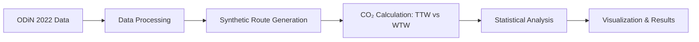

# CO₂ Emissions Calculator for Commuting in the Netherlands

[](https://opensource.org/licenses/MIT)
[](https://www.python.org/downloads/)
[](https://example.com)

> **Research Software for Master's Thesis**
> *Evaluating CO₂ Emissions from Commuting and the Work-Related Personal Mobility (WPM) Reporting Regulation*

---

## About This Research

This repository contains the computational implementation and data analysis pipeline for a master's thesis investigating commuting-related CO₂ emissions in the Netherlands. The research evaluates the effectiveness of the Dutch Work-Related Personal Mobility (WPM) reporting regulation and demonstrates a **38.7% systematic underestimation** of actual emissions when using the regulation's prescribed Tank-to-Wheel (TTW) methodology compared to comprehensive Well-to-Wheel (WTW) lifecycle assessment.

### Key Finding

**The WPM regulation's TTW methodology underestimates commuting CO₂ emissions by an average of 38.7%**, hindering effective climate policy and corporate sustainability strategies.

### Research Questions

1. How do commuting practices in the Netherlands influence CO₂ emissions, and what role do mode choices play?
2. How can European-level policies (Twin Transition, Open Data initiatives) influence emissions reporting?
3. What are the limitations of the WPM Regulation compared to comprehensive lifecycle methodologies?
4. What decision support tools can encourage sustainable commuting practices?

---

## Methodology

### Data Sources

- **ODiN 2022 Travel Survey** (Onderweg in Nederland): National travel behavior dataset
- **OpenStreetMap (OSM)**: Geospatial data for route generation
- **GTFS Data**: Public transit schedules for multimodal routing
- **CBS Statistics Netherlands**: Vehicle fleet emission factors

### Analysis Pipeline



1. **Data Processing**: Clean and extract commuting patterns from ODiN 2022 survey
2. **Route Generation**: Create synthetic origin-destination pairs using OpenTripPlanner API
3. **Emissions Calculation**: Compute CO₂ emissions using both TTW (WPM) and WTW methodologies
4. **Statistical Testing**: Paired t-tests, ANOVA, linear regression to validate findings
5. **Visualization**: Generate maps, charts, and heatmaps for research communication

### Emissions Methodologies Compared

| Methodology | Scope | Emissions Included | Regulation |
|-------------|-------|-------------------|------------|
| **TTW** (Tank-to-Wheel) | Operational | Tailpipe emissions only | WPM Regulation |
| **WTW** (Well-to-Wheel) | Lifecycle | Production, distribution, combustion | GHG Protocol, CSRD |

**Result**: WTW emissions are 38.7% higher on average, revealing systematic underreporting in current Dutch regulation.

---

## Repository Structure

```
.
├── scripts/                          # Python analysis scripts
│   ├── CO2_Calculator.py             # Main emissions calculator (TTW vs WTW)
│   ├── OTP_routing.py                # Route generation via OpenTripPlanner
│   ├── Zipcode_Processing.py         # Geospatial data processing
│   ├── EDA_ODiN.py                   # Exploratory data analysis
│   ├── Hypothesis_Testing.py         # Statistical hypothesis testing
│   ├── Visualisation.py              # Chart and map generation
│   └── utils/                        # Helper functions
│
├── data/                             # Data directory (see .gitignore)
│   ├── raw/                          # Original datasets (not tracked)
│   ├── processed/                    # Cleaned data (not tracked)
│   └── outputs/                      # Results (not tracked)
│
├── Qgis/                             # QGIS project files for spatial analysis
├── .gitignore                        # Excludes large data files
└── README.md                         # This file
```

**Note**: Large datasets and outputs are excluded from version control. See [Data Availability](#data-availability) for access information.

---

## Installation & Usage

### Prerequisites

- Python 3.8 or higher
- OpenTripPlanner server (for route generation)
- Internet connection (for API calls: Nominatim, OTP)

### Setup

```bash
# Clone repository
git clone https://github.com/giovanto/Co2-Emission-Calculator-for-Commuting-in-The-Netherlands.git
cd Co2-Emission-Calculator-for-Commuting-in-The-Netherlands

# Install dependencies (recommended: use virtual environment)
pip install -r requirements.txt
```

### Running the Analysis

```bash
# 1. Process ODiN survey data
python scripts/EDA_ODiN.py

# 2. Generate synthetic routes
python scripts/OTP_routing.py

# 3. Calculate emissions (TTW and WTW)
python scripts/CO2_Calculator.py

# 4. Perform statistical tests
python scripts/Hypothesis_Testing.py

# 5. Generate visualizations
python scripts/Visualisation.py
```

---

## Key Results

### Statistical Findings

| Hypothesis | Method | p-value | Result |
|------------|--------|---------|--------|
| H1: TTW ≠ WTW emissions | Paired t-test | < 0.001 | **Significant difference (38.7%)** |
| H2: Distance affects emissions | Linear regression | < 0.001 | Strong positive correlation |
| H3: Mode choice affects emissions | ANOVA | < 0.001 | Car >> Transit >> Bicycle |
| H4: Cycling < Other modes (<10km) | t-test | < 0.001 | Cycling significantly lower |

### Emissions by Transport Mode (WTW Methodology)

| Mode | Average Emissions (g CO₂/km) |
|------|------------------------------|
| Car | 194.5 |
| Public Transit (Bus) | 104.0 |
| Public Transit (Train) | 41.0 |
| E-Bike | 22.0 |
| Bicycle | 0 |

*Source: Calculated using Dutch fleet averages and IPCC lifecycle factors*

---

## Reproducibility

This research follows open science principles:

- ✅ **Open Data**: Primary dataset (ODiN 2022) publicly available via SSH Data Stations
- ✅ **Open Source**: All analysis code published under MIT License
- ✅ **Documented Methods**: Complete methodology in accompanying thesis
- ✅ **Version Control**: Full Git history preserves analysis evolution
- ✅ **API-Based**: Reproducible synthetic data generation using public APIs

### Reproducing Results

1. Download ODiN 2022 dataset from [SSH Data Stations](https://ssh.datastations.nl/dataset.xhtml?persistentId=doi:10.17026/SS/BXIK2X)
2. Set up OpenTripPlanner server with Dutch GTFS and OSM data
3. Run scripts in sequence (see [Usage](#running-the-analysis))
4. Compare outputs to published results in thesis

**Estimated computation time**: ~4-6 hours (route generation is time-intensive)

---

## Citation

**Thesis** (publication pending):

```bibtex
@mastersthesis{antoniazzi2025commuting,
  author = {Antoniazzi, Giovanni},
  title = {Evaluating CO₂ Emissions from Commuting in the Netherlands:
           Assessing the Work-Related Personal Mobility Reporting Regulation},
  school = {KTH Royal Institute of Technology / EIT Digital},
  year = {2025},
  type = {Master's Thesis},
  note = {Thesis available at: [URL to be added after supervisor upload]}
}
```

**Software**:

```bibtex
@software{antoniazzi2025calculator,
  author = {Antoniazzi, Giovanni},
  title = {CO₂ Emissions Calculator for Commuting in the Netherlands},
  year = {2025},
  url = {https://github.com/giovanto/Co2-Emission-Calculator-for-Commuting-in-The-Netherlands},
  version = {1.0.0}
}
```

---

## Data Availability

### Public Datasets Used

- **ODiN 2022**: [doi:10.17026/SS/BXIK2X](https://ssh.datastations.nl/dataset.xhtml?persistentId=doi:10.17026/SS/BXIK2X)
- **OpenStreetMap Netherlands**: [Geofabrik download](https://download.geofabrik.de/europe/netherlands.html)
- **GTFS Netherlands**: Available through transit operators' open data portals

### Generated Data

Due to GitHub file size limitations, synthetic route data and emissions calculations are not included in this repository. Researchers can regenerate these outputs by running the analysis scripts.

**Contact** for access to pre-generated datasets: [giovanni.antoniazzi@example.com]

---

## Contributing

This repository contains research software for an academic thesis. While it is not actively maintained for production use, contributions for the following are welcome:

- 🐛 Bug fixes in calculation logic
- 📚 Documentation improvements
- 🔬 Extensions for other regions or datasets
- 🧪 Additional validation tests

Please open an issue before submitting pull requests.

---

## License

This project is licensed under the **MIT License** - see the [LICENSE](LICENSE) file for details.

### Third-Party Data Licenses

- ODiN 2022 data: Licensed by SSH Data Stations (citation required)
- OpenStreetMap data: [ODbL 1.0](https://opendatacommons.org/licenses/odbl/)

---

## Acknowledgments

### Institutions

- **KTH Royal Institute of Technology** - Department of Sustainable Development
- **EIT Digital Master School** - Data Science Program

### Data Providers

- **Statistics Netherlands (CBS)** - Emission factor data
- **SSH Data Stations** - ODiN 2022 Travel Survey
- **OpenStreetMap Contributors** - Geospatial data
- **Transit Operators** - GTFS schedule data

### Supervisors

- Dr. Fariya Sharmeen (KTH Royal Institute of Technology)
- [Add co-supervisor if applicable]

### Tools & APIs

- [OpenTripPlanner](https://www.opentripplanner.org/) - Multimodal routing engine
- [Nominatim](https://nominatim.org/) - Geocoding service
- Python scientific stack: NumPy, Pandas, Matplotlib, GeoPandas

---

## Related Research

This work contributes to the broader research on:

- Urban mobility and sustainable transport
- Lifecycle assessment of transportation emissions
- Corporate sustainability reporting (CSRD, GHG Protocol)
- Open Data applications in climate policy

**Keywords**: CO₂ emissions, commuting, lifecycle assessment, WPM regulation, Netherlands, sustainable mobility, open data, GHG reporting

---

## Contact

**Giovanni Antoniazzi**
Master's Student, EIT Digital Data Science
📧 [giovanni.antoniazzi@example.com]
🔗 [LinkedIn](https://linkedin.com/in/your-profile) | [ORCID](https://orcid.org/0000-0000-0000-0000)

---

**Last Updated**: October 2025
**Status**: Thesis submission pending supervisor approval
